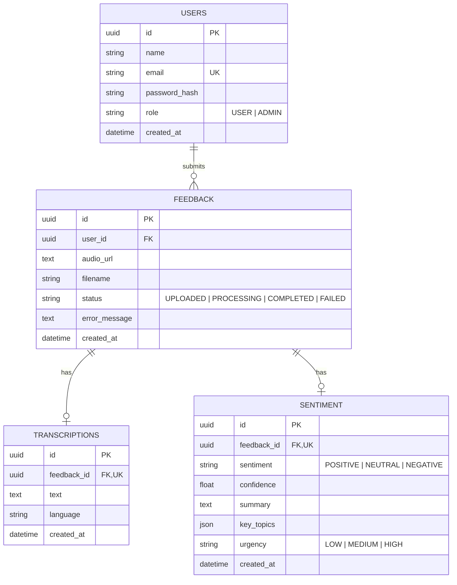

# Medlio — Voice-Enabled Customer Feedback Portal

A full-stack, enterprise-grade Voice Feedback Management Platform built with React, Flask, PostgreSQL (Supabase), Cloudflare R2 Cloud Object Storage, Groq Whisper Large V3 STT, and Google Gemini Flash AI.

---

## 🚀 Key Features

- **Dynamic Voice Recorder**: Built-in browser audio recording widget with automatic MIME type detection (`audio/webm`, `audio/mp4`, `audio/wav`) and native audio player preview.
- **Cloud Object Storage (Cloudflare R2)**: Direct S3-compatible cloud object storage integration with dynamic presigned 24-hour GET URL generation for secure audio playback.
- **Multilingual Speech-to-Text (STT)**: High-accuracy transcription powered by **Groq Whisper Large V3** (supports English, Marathi, Hindi, and 90+ languages).
- **AI Sentiment Analysis**: Automated structured sentiment extraction powered by **Google Gemini Flash** (provides Sentiment rating, Confidence score, Summary, Key Topics, and Urgency rating).
- **Asynchronous Background Processing**: Non-blocking audio processing pipeline (`UPLOADED` → `PROCESSING` → `COMPLETED` / `FAILED`).
- **Admin Dashboard**: Comprehensive admin control panel featuring eager-loaded submission lists (preventing N+1 queries), HTML5 audio playback, transcriptions, and AI metrics.
- **Security & RBAC**: JWT authentication with strict Role-Based Access Control (`USER` / `ADMIN`), public registration hardcoding, and strict file MIME type / 15MB size validation.

---

## 🛠️ Architecture & Tech Stack

### Frontend
- **Framework**: React 18 (SPA)
- **UI Components**: Material UI (MUI v5)
- **Routing & State**: React Router v6 & React Context API
- **Testing**: React Testing Library & Jest

### Backend
- **Framework**: Python 3.13 / Flask REST API
- **Authentication**: Flask-JWT-Extended (Role Claims)
- **Database**: PostgreSQL (Supabase) via SQLAlchemy ORM (UUID Primary Keys)
- **Package Manager**: `uv`

### Cloud Infrastructure & AI Services
- **Audio Object Storage**: Cloudflare R2 (S3 API via `boto3`)
- **Speech-to-Text**: Groq Whisper Large V3 API
- **Sentiment Analysis**: Google Gemini 2.5 Flash API

---

## 📊 Database Schema



---

## 🔌 API Endpoints Summary

### Authentication (`/auth`)
| Method | Endpoint | Access | Description |
| :--- | :--- | :--- | :--- |
| `POST` | `/auth/register` | Public | Register standard user account (`role: USER`) |
| `POST` | `/auth/login` | Public | Authenticate user & return JWT token + role |

### User Endpoints (`/user`)
| Method | Endpoint | Access | Description |
| :--- | :--- | :--- | :--- |
| `POST` | `/user/feedback` | User | Upload voice audio file (`multipart/form-data`) |
| `GET` | `/user/feedback` | User | List all feedback submitted by authenticated user |
| `GET` | `/user/feedback/:id` | User | View detail of specific feedback item |

### Admin Endpoints (`/admin`)
| Method | Endpoint | Access | Description |
| :--- | :--- | :--- | :--- |
| `GET` | `/admin/feedback` | Admin | List all feedback across users (eager loaded JOIN) |
| `GET` | `/admin/feedback/:id` | Admin | View detail with dynamic presigned R2 playback URL |

---

## 🎙️ Recording Limitations & Audio Constraints

- **Maximum Audio File Size**: Hard ceiling of **15 MB** enforced at API level to prevent storage bloat and server DoS.
- **Supported Audio MIME Types**:
  - `audio/webm` (Standard for Chrome, Firefox, Edge)
  - `audio/mp4` / `audio/aac` (Standard for Safari, iOS Safari)
  - `audio/wav` / `audio/x-wav`
  - `audio/mp3` / `audio/mpeg`
  - `audio/ogg`
- **Browser Constraints**: MediaRecorder requires HTTPS or `localhost` context to access user microphone permissions.
- **STT Processing Bounds**: Groq Whisper Large V3 API accepts audio files up to 25 MB. Inputs exceeding 15 MB are rejected upfront by Flask backend.

---

## ⚙️ Getting Started & Setup

### Prerequisites
- **Node.js** (v18+)
- **Python** (3.13+)
- **uv** (Python package installer)

### 1. Backend Setup

```bash
cd backend

# Create virtual environment and install dependencies
uv sync

# Configure Environment Variables in backend/.env
# (See backend/.env.example for required keys: DATABASE_URL, R2_*, GROQ_API_KEY, GEMINI_API_KEY)

# Run Pytest suite (7/7 tests passing)
uv run pytest

# Start Backend Flask Server (Runs on http://127.0.0.1:5000)
uv run python run.py
```

### 2. Frontend Setup

```bash
cd frontend

# Install Dependencies
npm install --legacy-peer-deps

# Run Jest Frontend Test Suite (8/8 tests passing)
$env:CI="true"; npx react-scripts test

# Run ESLint Audit (0 errors)
npx eslint src/

# Start React Frontend (Runs on http://localhost:3000)
npm start
```

---

## 🔧 Troubleshooting & Edge Cases

### 1. Database Connection Failure (`Network is unreachable` on Render)
- **Cause**: Render's free tier web services operate on IPv4-only networks, whereas direct Supabase DB hosts (`db.<ref>.supabase.co:5432`) resolve to IPv6 addresses.
- **Fix**: Use the Supabase IPv4 Pooler URL on port `6543` (`postgresql://postgres.<ref>:<password>@aws-0-<region>.pooler.supabase.com:6543/postgres`).

### 2. Audio Playback Authorization / CORS Errors
- **Cause**: Browser blocking cross-origin audio playback from S3/R2 presigned URLs.
- **Fix**: Ensure Cloudflare R2 bucket CORS policy allows `GET` requests from your frontend origin URL.

### 3. Invalid File Type or Large File Error
- **Cause**: Uploading non-audio formats or files > 15 MB.
- **Fix**: API returns `400 Bad Request` with message: `"Invalid file type. Only audio files are allowed."` or `"File size exceeds maximum allowed limit of 15MB."`.

---

## 🧪 Testing Coverage

- **Backend Tests (`pytest`)**: 7 Unit & Integration tests covering JWT auth, RBAC permissions, audio uploads, and pipeline status transitions.
- **Frontend Tests (`Jest` + `React Testing Library`)**: 4 Unit test suites (8 tests total) covering Login, Register, Voice Feedback Upload, and Admin Dashboard components.
- **Linting Compliance**: 100% ESLint & Python compilation compliant (`0` errors, `0` warnings).
